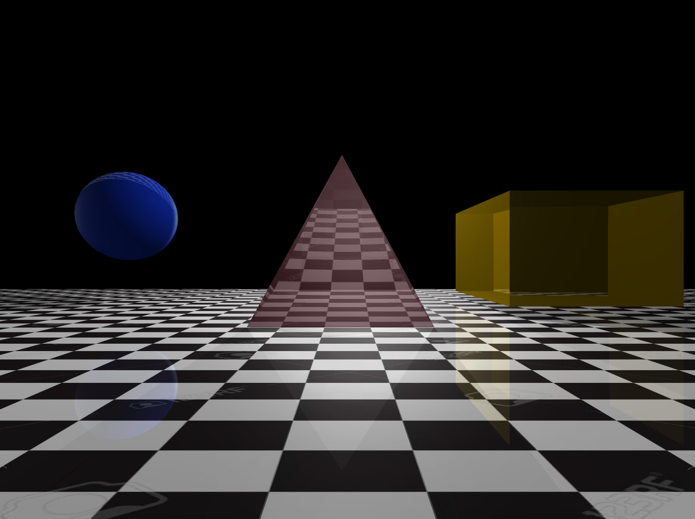

# RT
A 3D ray-tracing program that renders computer generated images.

# 
<p align="center">A scene including 80% of the features in this project.</p>

A 42 project done with Jeongmo Bae (@jebae), Samuel Boniface (@sabonifa), and Alexandru Moraru (@almoraru).

# INSTALLATION

## Web Interface
- Install Node.js

## RT Program
Run make inside the repo.
```
$ make path/to/repo
```
# LAUNCHING 
## RT Program
- The program takes an xml scene file as the input, you can create your own or use the already created scenes.
- Modified files modified and saved are rerendered due to hot-loading implemented in project.
```
$ ./rtv1 scenes/file_name.xml
```

## Web Interface
```
$ node path/to/interface/index.js
```

# FEATURES
## RT
- 11 Objects: cone, cylinder, plane, sphere, box, ellipsoid, ring, parabaloid, pyramid, rectangle, and triangle.
- Shadows
- Multispot Lighting
- Spherical and directional lighting
- Ambient lighting
- Filters: grey, blur, sepia, and negative<br/>
&nbsp;&nbsp;&nbsp;&nbsp;&nbsp;-> For filter add the following tag to the XML file (but not within the objects tag): <br/>
```
      $ <filter>sepia | grey | negative | blur</filter>
```
- Cel-shading (cartoon effect)
&nbsp;&nbsp;&nbsp;&nbsp;&nbsp;-> For cel-shading add the following tag to the XML file (but not within the objects tag): <br/>
```
      $ <cel_shading>true | false</cel_shading>
```
- Translation and rotation (camera and shapes)
- XML parsing and debugging
- Refraction, reflection, and transparency
- Texture mapping <br/>
&nbsp;&nbsp;&nbsp;&nbsp;&nbsp;For texture mapping add the following tag to the XML file:<br/>
```
      $ <texture>
      $   <file>name_of_file</file>
      $   <reapeat>1</repeat>
      $ </texture>
```
- Texture bumping <br/>
&nbsp;&nbsp;&nbsp;&nbsp;&nbsp; -> For texture bumping add the following tag to the XML file: <br/>
```
      $ <bump_map>
      $   <file>name_of_file</file>
      $   <reapeat>1</repeat>
      $ </bump_map>
```
<br/>
- Rotation and translation
- Multithread computation
- Hot-loading
- Color

## WEB INTERFACE
# 
- Live update for chosen file
- Modify camera
- Add a new object
# 

# 
<p align="center">A scene including texture maping, reflection, and transparency.</p>

# 
<p align="center">A scene including texture mapping and tranparency.</p>

